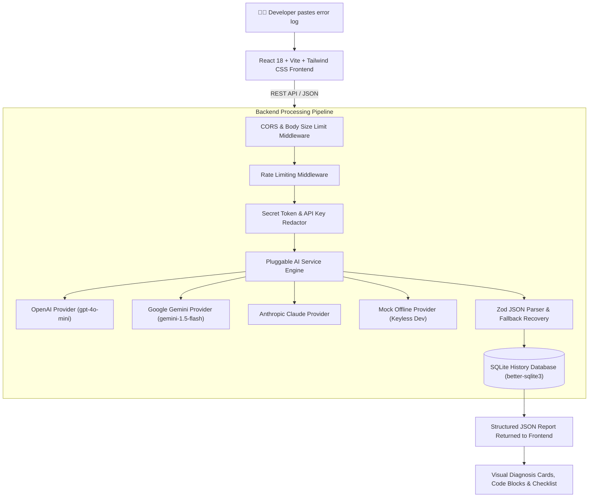

# Code-Error-Explainer 🛠️

**AI Error Explainer** is a developer tool designed to eliminate debugging headaches. When developers encounter cryptic stack traces, compiler errors, build failures, database exceptions, or server logs, they can paste the raw error output into this application to instantly receive a structured, beginner-accessible, plain-English breakdown with actionable fixes.

---

## 🎯 What Problem Does This Project Solve?

When programming, developers frequently face error logs like:
```text
TypeError: Cannot read properties of undefined (reading 'map')
    at UserList (http://localhost:5173/src/components/UserList.tsx:14:22)
```
For beginners, this can be overwhelming. Experienced developers spend valuable time searching forums for root causes. 

**AI Error Explainer** automates this by:
1. Identifying **What the error means** in plain English.
2. Explaining **Why it happened** (Root Cause analysis).
3. Extracting **Which exact line of code** broke.
4. Providing **Copyable fixed code** with defensive programming checks.
5. Offering a **Step-by-Step Debugging Checklist** to verify the fix.

---

## 🏗️ System Architecture & How It Works



---

## ✨ Key Features & Capabilities

- 📄 **Multi-Format Error Input**: Accepts JavaScript/TypeScript errors, Python tracebacks, Rust compiler errors, Docker build logs, SQL database exceptions, and Linux server errors.
- ⚙️ **Environment Context Matching**: Optional selection for Programming Language, Framework (React, Express, FastAPI, Django, Docker), OS, and Environment runtime.
- 🛡️ **Privacy & Automatic Secret Redaction**: Automatically redacts JWTs, AWS credentials, OpenAI/Gemini API keys, connection string passwords, and private RSA keys before sending inputs to AI.
- 🔌 **Pluggable AI Provider**: Abstracted AI layer allowing effortless switching between **OpenAI (`gpt-4o-mini`)**, **Google Gemini (`gemini-1.5-flash`)**, **Anthropic Claude**, or offline **Mock Provider** via environment variables (`AI_PROVIDER`).
- ⚡ **Strict JSON Output & Zero-Crash Fallback**: AI outputs are strictly parsed with Zod schemas. If model formatting varies, a fallback recovery parser formats the response without crashing the server.
- 💾 **SQLite History & Persistence**: Automatically saves analyses into an embedded SQLite database (`better-sqlite3`) with search filtering, detail inspection modals, and deletion controls.
- 🎨 **Developer UX & Dark Theme**: Built with **Inter** and **JetBrains Mono** fonts, responsive layouts, smooth loading skeletons, copy buttons, and fault-tolerant React Error Boundaries.

---

## 🚀 How to Run the Project on Your Machine

### Prerequisites
- [Node.js v22.x or higher](https://nodejs.org/) installed.
- [Git](https://git-scm.com/) installed.

---

### Method 1: Local Node.js Development (Recommended)

#### Step 1: Clone the repository
```bash
git clone https://github.com/vthish/Code-Error-Explainer.git
cd Code-Error-Explainer
```

#### Step 2: Start Backend Server
```bash
cd backend
cp .env.example .env
npm install
npm run dev
```
> The Backend API server will start at: `http://localhost:3001`
> *Note: By default, `AI_PROVIDER=mock` is active, allowing full testing without needing an OpenAI or Gemini API key!*

#### Step 3: Start Frontend Web App (In a new terminal window)
```bash
cd frontend
npm install
npm run dev
```
> The Frontend Web App will start at: `http://localhost:5173`

Open `http://localhost:5173` in your browser to start analyzing errors!

---

### Method 2: Single-Command Docker Deployment

If you have [Docker Desktop](https://www.docker.com/products/docker-desktop/) installed:

```bash
docker-compose up -d --build
```

* **Frontend Web App**: `http://localhost`
* **Backend Health Check**: `http://localhost:3001/api/health`

To stop the containers:
```bash
docker-compose down
```

---

## 🧪 Running Automated Unit & Integration Tests

Run the complete test suite (Health checks, AI Provider logic, Secret Redaction, SQLite CRUD operations):

```bash
cd backend
npm test
```

Expected Output:
```text
 ✓ tests/ai.test.ts (7 tests)
 ✓ tests/health.test.ts (2 tests)
 ✓ tests/analysis.test.ts (5 tests)
 Test Files  3 passed (3)
      Tests  14 passed (14)
```

---

## 🔧 Environment Variables Reference (`backend/.env`)

| Variable | Default Value | Description |
| :--- | :--- | :--- |
| `APP_ENV` | `development` | Server mode (`development` \| `production` \| `test`) |
| `APP_HOST` | `0.0.0.0` | Host IP address binding |
| `APP_PORT` | `3001` | Backend HTTP port |
| `FRONTEND_ORIGIN` | `http://localhost:5173` | Allowed CORS origin |
| `DATABASE_PATH` | `./data/error_explainer.db` | Path to embedded SQLite database file |
| `AI_PROVIDER` | `mock` | Active provider (`mock` \| `openai` \| `gemini` \| `anthropic`) |
| `OPENAI_API_KEY` | `""` | OpenAI API Key (Required if `AI_PROVIDER=openai`) |
| `OPENAI_MODEL` | `gpt-4o-mini` | OpenAI Model |
| `GEMINI_API_KEY` | `""` | Google Gemini API Key (Required if `AI_PROVIDER=gemini`) |
| `GEMINI_MODEL` | `gemini-1.5-flash` | Gemini Model |
| `ANTHROPIC_API_KEY` | `""` | Anthropic API Key (Required if `AI_PROVIDER=anthropic`) |
| `MAX_ERROR_INPUT_LENGTH` | `10000` | Maximum character length allowed for submitted error text |
| `RATE_LIMIT_REQUESTS` | `30` | Request limit per IP per minute |

---

## 📡 REST API Documentation

### `POST /api/analyze`
Analyzes an error log and returns structured diagnosis JSON while saving the record.

#### Request Body
```json
{
  "error_text": "TypeError: Cannot read properties of undefined (reading 'map')",
  "language": "TypeScript",
  "framework": "React",
  "code_context": "const items = data.users.map(u => u.name);"
}
```

#### Response (200 OK)
```json
{
  "id": "anls_98a72f10-4c3e-4d89-9a21-1b2c3d4e5f6a",
  "error_text": "TypeError: Cannot read properties of undefined (reading 'map')",
  "language": "TypeScript",
  "framework": "React",
  "result": {
    "error_type": "Runtime Error",
    "severity": "medium",
    "summary": "The application attempted to call .map() on an undefined object property.",
    "explanation": "In React, when rendering asynchronous state, 'data' or 'data.users' may initially be undefined before API fetch completes.",
    "likely_cause": "The property 'users' on 'data' was undefined when render was invoked.",
    "important_lines": [
      "TypeError: Cannot read properties of undefined (reading 'map')"
    ],
    "possible_causes": [
      "API request has not finished loading when rendering.",
      "State was initialized to undefined or null."
    ],
    "solutions": [
      {
        "title": "Use Optional Chaining & Fallback",
        "description": "Safely access items with optional chaining and provide an empty array default."
      }
    ],
    "fixed_code": "const items = data?.users ?? [];\nreturn items.map(u => u.name);",
    "debug_steps": [
      "Log the API response prior to render.",
      "Ensure loading state is handled before rendering."
    ],
    "confidence": "high"
  },
  "created_at": "2026-10-04T00:35:00Z"
}
```

---

## 📄 License

This project is licensed under the MIT License - see the LICENSE file for details.
