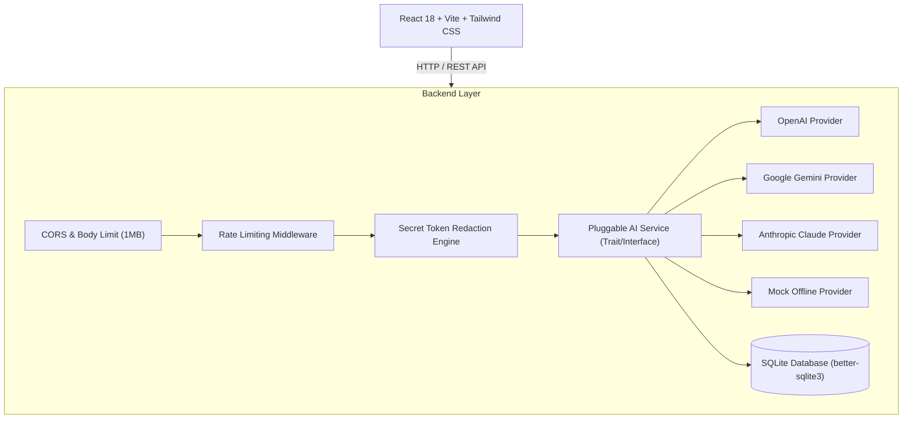

# Code-Error-Explainer 🚀

An AI-powered developer tool designed to analyze cryptic error messages, stack traces, compiler errors, build logs, and environment failures to produce structured, plain-English summaries, root cause diagnoses, highlighted error lines, actionable fixes, and step-by-step debugging checklists.

---

## 🌟 Key Features

* **Multi-Format Input**: Accepts stack traces, compiler errors (Rust, C++, Go, Java), build failures (Docker, Webpack, Vite), database exceptions (PostgreSQL, MySQL), and runtime logs.
* **Environment Context Matching**: Optional metadata options for Programming Language, Framework, Operating System, and Environment runtime.
* **Pluggable AI Architecture**: Server-side AI abstraction supporting **OpenAI (`gpt-4o-mini`)**, **Google Gemini (`gemini-1.5-flash`)**, **Anthropic Claude**, and an offline **Mock Provider**.
* **Privacy & Secret Redaction**: Automatic server-side filtering redacting JWTs, AWS access keys, OpenAI/Gemini API keys, database connection string passwords, and private RSA keys before AI processing.
* **Structured Visual Reports**:
  * Error Type & Severity Badges (`LOW`, `MEDIUM`, `HIGH`, `CRITICAL`).
  * Plain-English Summary & Likely Root Cause Cards.
  * Extracted Key Stack Trace Error Lines.
  * Recommended Fixes & Copyable Code Blocks with One-Click Copy Buttons.
  * Interactive Step-by-Step Debugging Checklist.
* **Analysis History**: SQLite database persistence for reviewing past diagnoses, reopening saved reports, and deleting entries.
* **Developer UX & Dark Theme**: Built with Inter & JetBrains Mono typography, smooth loading skeletons, responsive layout, toast feedback, and fault-tolerant Error Boundaries.

---

## 🛠️ Architecture & Tech Stack



### Technology Stack
- **Frontend**: React 18, TypeScript, Vite, Tailwind CSS v3, TanStack Query v5, Lucide Icons, React Router v6
- **Backend**: Node.js 22, Express, TypeScript, Zod, `better-sqlite3`, Vitest
- **Containerization**: Docker, Docker Compose, NGINX Alpine

---

## 🚀 Quick Start Guide

### Prerequisites
- Node.js v22.x or higher
- npm v10.x or higher

### 1. Local Development Setup

#### Clone repository & setup backend:
```bash
git clone https://github.com/vthish/Code-Error-Explainer.git
cd Code-Error-Explainer

# Setup Backend
cd backend
cp .env.example .env
npm install
npm run dev
```
The backend API will run at `http://localhost:3001`.

#### Setup frontend (in a separate terminal):
```bash
cd frontend
npm install
npm run dev
```
The frontend web app will run at `http://localhost:5173`.

---

### 2. Docker Compose Deployment

Run the entire full stack in production mode with a single command:

```bash
docker-compose up -d --build
```
* **Frontend UI**: `http://localhost`
* **Backend API**: `http://localhost:3001/api/health`

---

## 🔑 Environment Variables Reference

| Variable | Default | Description |
| :--- | :--- | :--- |
| `APP_ENV` | `development` | Deployment environment (`development` \| `production` \| `test`) |
| `APP_PORT` | `3001` | Backend HTTP server port |
| `FRONTEND_ORIGIN` | `http://localhost:5173` | Allowed CORS origin |
| `DATABASE_PATH` | `./data/error_explainer.db` | Path to SQLite database file |
| `AI_PROVIDER` | `mock` | Active provider (`mock` \| `openai` \| `gemini` \| `anthropic`) |
| `OPENAI_API_KEY` | `""` | OpenAI API key (required if `AI_PROVIDER=openai`) |
| `OPENAI_MODEL` | `gpt-4o-mini` | OpenAI chat completion model |
| `GEMINI_API_KEY` | `""` | Google Gemini API key (required if `AI_PROVIDER=gemini`) |
| `GEMINI_MODEL` | `gemini-1.5-flash` | Gemini model name |
| `ANTHROPIC_API_KEY` | `""` | Anthropic API key (required if `AI_PROVIDER=anthropic`) |
| `MAX_ERROR_INPUT_LENGTH` | `10000` | Maximum character length for submitted error text |
| `RATE_LIMIT_REQUESTS` | `30` | Maximum requests per IP per minute |

---

## 📡 REST API Specification

### `POST /api/analyze`
Submits an error text for AI analysis and persists the record.

#### Request Payload
```json
{
  "error_text": "TypeError: Cannot read properties of undefined (reading 'map')",
  "language": "TypeScript",
  "framework": "React",
  "code_context": "const items = data.users.map(u => u.name);"
}
```

#### Response (200 OK)
```json
{
  "id": "anls_98a72f10-4c3e-4d89-9a21-1b2c3d4e5f6a",
  "error_text": "TypeError: Cannot read properties of undefined (reading 'map')",
  "language": "TypeScript",
  "framework": "React",
  "result": {
    "error_type": "Runtime Error",
    "severity": "medium",
    "summary": "The application attempted to call .map() on an undefined object property.",
    "explanation": "In React, when rendering asynchronous state, 'data' or 'data.users' may initially be undefined before API fetch completes.",
    "likely_cause": "The property 'users' on 'data' was undefined when render was invoked.",
    "important_lines": [
      "TypeError: Cannot read properties of undefined (reading 'map')"
    ],
    "possible_causes": [
      "API request has not finished loading when rendering.",
      "State was initialized to undefined or null."
    ],
    "solutions": [
      {
        "title": "Use Optional Chaining & Fallback",
        "description": "Safely access items with optional chaining and provide an empty array default."
      }
    ],
    "fixed_code": "const items = data?.users ?? [];\nreturn items.map(u => u.name);",
    "debug_steps": [
      "Log the API response prior to render.",
      "Ensure loading state is handled."
    ],
    "confidence": "high"
  },
  "created_at": "2026-10-04T00:35:00Z"
}
```

### Additional Endpoints
* `GET /api/health` - Service health status check
* `GET /api/analyses?limit=20&offset=0` - List recent saved analyses
* `GET /api/analyses/:id` - Fetch specific analysis details
* `DELETE /api/analyses/:id` - Delete an analysis record from SQLite

---

## 🧪 Running Automated Tests

Run full integration & unit test suite in `backend/`:

```bash
cd backend
npm test
```

Tests verify API endpoints, schema validation, secret redaction, SQLite database CRUD, prompt engineering, and fallback JSON parser recovery.

---

## 🔒 Security & Privacy Statement

Developer logs often contain sensitive operational data. **AI Error Explainer** strictly enforces:
1. **Server-Side API Key Storage**: API keys are never sent to or visible in client browser bundles.
2. **Secret Redaction**: Regex engines automatically redact JWTs, AWS credentials, connection string passwords, and private RSA keys before passing prompt texts to AI APIs.
3. **Payload Bounds**: Enforces 10,000 max character limit on inputs and 1MB JSON body limits to mitigate abuse.

---

## 📄 License

Distributed under the MIT License.
