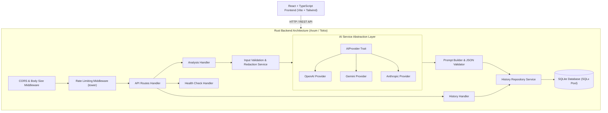

# AI Error Explainer - Stage 1 Architecture & Design Specification

## 1. Final MVP Scope

### In-Scope (MVP)
* **Error Text / Stack Trace / Log Input**: Multi-line clean textarea with clear actions and example errors.
* **Context Selection**: Optional fields for Programming Language, Framework, Operating System, and Environment details.
* **AI Error Analysis Engine**: Abstracted AI layer capable of parsing unstructured error logs into strict structured JSON.
* **Structured Visual Report**:
  * Error Type & Severity Badge
  * Plain-English Summary & Likely Root Cause
  * Highlighted Important Error Lines
  * Categorized Possible Causes
  * Actionable Solutions with Copyable Fixes
  * Corrected Code Snippet with Syntax Highlighting
  * Step-by-Step Debugging Checklist
* **Analysis History**: SQLite database persistence allowing viewing past analyses, deleting entries, and re-running analyses.
* **Developer UX & Aesthetics**: First-class Dark Mode UI with modern typography (Inter/JetBrains Mono), responsive layout, smooth loading skeletons, subtle borders, micro-animations, and toast feedback.
* **Security & Privacy**: Client-side sensitive token warning, server-side log redaction, request size limits, CORS, rate limiting, and API key isolation.
* **Containerization & Testing**: `docker-compose` setup for full stack, backend Rust tests, and frontend test suite.

### Out-of-Scope (Deferred to Future Releases)
* User accounts, OAuth authentication, multi-tenant teams, billing.
* Real-time collaborative debugging or public shareable links.
* IDE extensions (VS Code, JetBrains) and CLI binaries.
* OCR error screenshot parsing or file upload processing.

---

## 2. System Architecture



---

## 3. Technology Choices & Justification

| Layer | Selected Tech | Rationale |
| :--- | :--- | :--- |
| **Backend Framework** | Node.js 22 + Express + TypeScript | Type safety, rapid async execution, shared TypeScript interfaces with frontend. |
| **Backend ORM / DB** | SQLite (`better-sqlite3`) | Embedded zero-config DB for MVP, synchronous speed, compile-safe schema migrations. |
| **Serialization** | Native JSON / `zod` | Clean request payload validation & structured JSON response schemas. |
| **Frontend Framework** | React 18 + TypeScript + Vite | Rapid development, strong typing, optimized build outputs. |
| **State & Async Data** | `@tanstack/react-query` v5 | Declarative data fetching, automatic caching, re-validation, and smooth pending states. |
| **Styling & UI** | Tailwind CSS v3 + Lucide Icons | Clean developer aesthetic, responsive utilities, seamless dark mode. |
| **Code Highlighting** | `prismjs` or `highlight.js` | Fast, lightweight syntax rendering for code snippets. |
| **AI Integration** | `fetch` / SDK clients behind interface | Flexible provider swapping via environment variables without re-architecting handlers. |

---

## 4. Directory & Codebase Structure

```
ai-error-explainer/
├── .env.example
├── docker-compose.yml
├── README.md
├── STAGE1_DESIGN.md
│
├── backend/
│   ├── Cargo.toml
│   ├── Dockerfile
│   ├── migrations/
│   │   └── 0001_create_analyses.sql
│   └── src/
│       ├── main.rs
│       ├── config/
│       │   └── mod.rs
│       ├── database/
│       │   ├── mod.rs
│       │   └── migrations.rs
│       ├── errors/
│       │   └── mod.rs
│       ├── handlers/
│       │   ├── mod.rs
│       │   ├── analysis.rs
│       │   ├── health.rs
│       │   └── history.rs
│       ├── middleware/
│       │   ├── mod.rs
│       │   ├── rate_limit.rs
│       │   └── request_id.rs
│       ├── models/
│       │   ├── mod.rs
│       │   ├── analysis.rs
│       │   └── error_type.rs
│       ├── services/
│       │   ├── mod.rs
│       │   ├── ai/
│       │   │   ├── mod.rs
│       │   │   ├── anthropic.rs
│       │   │   ├── gemini.rs
│       │   │   ├── openai.rs
│       │   │   ├── prompt.rs
│       │   │   └── provider.rs
│       │   └── history/
│       │       └── mod.rs
│       └── utils/
│           ├── mod.rs
│           └── redaction.rs
│
└── frontend/
    ├── package.json
    ├── tsconfig.json
    ├── vite.config.ts
    ├── tailwind.config.js
    ├── Dockerfile
    ├── index.html
    └── src/
        ├── main.tsx
        ├── App.tsx
        ├── index.css
        ├── components/
        │   ├── common/
        │   │   ├── Header.tsx
        │   │   ├── Footer.tsx
        │   │   ├── Button.tsx
        │   │   ├── Badge.tsx
        │   │   ├── Card.tsx
        │   │   ├── CodeBlock.tsx
        │   │   └── LoadingSkeleton.tsx
        │   └── layout/
        │       └── Navbar.tsx
        ├── features/
        │   ├── analyzer/
        │   │   ├── AnalyzerForm.tsx
        │   │   ├── AnalyzerResult.tsx
        │   │   ├── SolutionCard.tsx
        │   │   └── DebugChecklist.tsx
        │   └── history/
        │       ├── HistoryList.tsx
        │       └── HistoryItemCard.tsx
        ├── pages/
        │   ├── AnalyzerPage.tsx
        │   ├── HistoryPage.tsx
        │   ├── AnalysisDetailPage.tsx
        │   └── NotFoundPage.tsx
        ├── services/
        │   ├── api.ts
        │   └── analyzerService.ts
        ├── hooks/
        │   ├── useAnalyzeError.ts
        │   └── useHistory.ts
        ├── types/
        │   └── index.ts
        └── utils/
            └── formatters.ts
```

---

## 5. Database Schema (SQLite / SQLx)

### Migration Script: `0001_create_analyses.sql`

```sql
CREATE TABLE IF NOT EXISTS analyses (
    id TEXT PRIMARY KEY NOT NULL,
    error_text TEXT NOT NULL,
    language TEXT,
    framework TEXT,
    environment TEXT,
    os TEXT,
    code_context TEXT,
    error_type TEXT NOT NULL,
    severity TEXT NOT NULL DEFAULT 'medium',
    summary TEXT NOT NULL,
    explanation TEXT NOT NULL,
    likely_cause TEXT NOT NULL,
    ai_result_json TEXT NOT NULL,
    created_at TIMESTAMP NOT NULL DEFAULT CURRENT_TIMESTAMP,
    updated_at TIMESTAMP NOT NULL DEFAULT CURRENT_TIMESTAMP
);

CREATE INDEX IF NOT EXISTS idx_analyses_created_at ON analyses(created_at DESC);
CREATE INDEX IF NOT EXISTS idx_analyses_error_type ON analyses(error_type);
```

---

## 6. REST API Specification

### Endpoints Overview

| Method | Endpoint | Description |
| :--- | :--- | :--- |
| `GET` | `/api/health` | Service health status |
| `POST` | `/api/analyze` | Submit error log for AI analysis |
| `GET` | `/api/analyses` | List recent saved analyses |
| `GET` | `/api/analyses/:id` | Fetch specific analysis detail |
| `DELETE` | `/api/analyses/:id` | Delete saved analysis entry |
| `POST` | `/api/analyses/:id/reanalyze` | Re-trigger analysis |

### Data Payloads

#### `POST /api/analyze` - Request Body
```json
{
  "error_text": "TypeError: Cannot read properties of undefined (reading 'map')",
  "language": "TypeScript",
  "framework": "React",
  "environment": "Browser",
  "os": "macOS",
  "code_context": "const renderList = () => { return data.items.map(item => <div key={item.id}>{item.name}</div>); };"
}
```

#### `POST /api/analyze` - Response (200 OK)
```json
{
  "id": "anls_98a72f10-4c3e-4d89-9a21-1b2c3d4e5f6a",
  "error_text": "TypeError: Cannot read properties of undefined (reading 'map')",
  "language": "TypeScript",
  "framework": "React",
  "environment": "Browser",
  "os": "macOS",
  "code_context": "const renderList = () => { return data.items.map(item => <div key={item.id}>{item.name}</div>); };",
  "result": {
    "error_type": "Runtime Error",
    "severity": "medium",
    "summary": "The code attempted to call .map() on an undefined object property.",
    "explanation": "In React, when rendering asynchronous state, 'data' or 'data.items' may initially be undefined before API fetch completes.",
    "likely_cause": "The property 'items' on 'data' was undefined at the moment renderList was invoked.",
    "important_lines": [
      "TypeError: Cannot read properties of undefined (reading 'map')"
    ],
    "possible_causes": [
      "API request has not finished loading when rendering.",
      "The API response object key is named differently (e.g. 'results' instead of 'items').",
      "State was initialized to undefined or null."
    ],
    "solutions": [
      {
        "title": "Use Optional Chaining & Fallback",
        "description": "Safely access items with optional chaining and provide an empty array default."
      }
    ],
    "fixed_code": "const items = data?.items ?? [];\nreturn items.map(item => (\n  <div key={item.id}>{item.name}</div>\n));",
    "debug_steps": [
      "Add console.log('Data payload:', data) before invoking renderList.",
      "Verify initial state declaration (e.g. useState({ items: [] })).",
      "Check network tab response structure."
    ],
    "confidence": "high"
  },
  "created_at": "2026-10-04T00:35:00Z"
}
```

#### Standard Error Response Format
```json
{
  "error": {
    "code": "INVALID_INPUT",
    "message": "The provided error_text exceeds the maximum allowed length of 10000 characters."
  }
}
```

---

## 7. AI Provider Architecture & Trait Abstraction

### Rust Trait Interface (`src/services/ai/provider.rs`)

```rust
use async_trait::async_trait;
use serde::{Deserialize, Serialize};
use crate::errors::AppError;

#[derive(Debug, Clone, Serialize, Deserialize)]
pub struct AnalysisInput {
    pub error_text: String,
    pub language: Option<String>,
    pub framework: Option<String>,
    pub environment: Option<String>,
    pub os: Option<String>,
    pub code_context: Option<String>,
}

#[derive(Debug, Clone, Serialize, Deserialize)]
pub struct SolutionItem {
    pub title: String,
    pub description: String,
}

#[derive(Debug, Clone, Serialize, Deserialize)]
pub struct AIAnalysisResult {
    pub error_type: String,
    pub severity: String,
    pub summary: String,
    pub explanation: String,
    pub likely_cause: String,
    pub important_lines: Vec<String>,
    pub possible_causes: Vec<String>,
    pub solutions: Vec<SolutionItem>,
    pub fixed_code: Option<String>,
    pub debug_steps: Vec<String>,
    pub confidence: String,
}

#[async_trait]
pub trait AIProvider: Send + Sync {
    async fn analyze_error(&self, input: &AnalysisInput) -> Result<AIAnalysisResult, AppError>;
    async fn health_check(&self) -> Result<bool, AppError>;
}
```

---

## 8. AI Prompt Strategy & Structured Schema Enforcement

### System Prompt Engineering
The system prompt enforces deterministic JSON output:

```text
You are an expert software developer and debugging assistant.
Your task is to analyze error messages, stack traces, compiler output, and log files.

CRITICAL INSTRUCTIONS:
1. Respond ONLY with valid, minified JSON matching the exact schema below.
2. DO NOT output Markdown formatting or code fences (e.g., NO ```json ... ```).
3. Do not assume guaranteed root causes when ambiguous—use appropriate confidence markers.
4. Keep explanations practical, beginner-friendly yet technically precise.
5. Provide minimal, safe, effective code fixes rather than complete application rewrites.

JSON SCHEMA:
{
  "error_type": "Syntax Error | Compilation Error | Runtime Error | Type Error | Dependency Error | Database Error | Network Error | Authentication Error | Authorization Error | Configuration Error | Environment Variable Error | Docker Error | Linux/System Error | API Error | Build Error | Package Manager Error | Framework Error | Unknown Error",
  "severity": "low | medium | high | critical",
  "summary": "One sentence explanation of the error",
  "explanation": "Detailed explanation of what occurred",
  "likely_cause": "The single most probable cause",
  "important_lines": ["extracted line 1", "extracted line 2"],
  "possible_causes": ["cause 1", "cause 2"],
  "solutions": [
    {"title": "Solution Title", "description": "How to resolve"}
  ],
  "fixed_code": "Corrected code snippet or null",
  "debug_steps": ["Step 1", "Step 2"],
  "confidence": "low | medium | high"
}
```

### Safety & Fallback Mechanism
1. Strip outer ```json tags if the model returns markdown code blocks despite prompt instructions.
2. Validate required JSON keys with `serde_json`.
3. If JSON parsing fails: log raw response, trigger a clean fallback parser attempt, or return a controlled error (`AI_PARSE_ERROR`) without crashing the application server.

---

## 9. Security & Privacy Strategy

1. **Environment Variable Guarding**: API keys strictly stored in server environment variables (`OPENAI_API_KEY`, `GEMINI_API_KEY`, `ANTHROPIC_API_KEY`), never exposed to frontend code.
2. **Redaction Engine**: Server-side utility regex redacting JWTs (`eyJ...`), AWS access keys (`AKIA...`), database URI password strings, and private RSA keys before sending prompts to external AI APIs.
3. **Payload Boundaries**:
   * Maximum input length: 10,000 characters for `error_text`.
   * Maximum context length: 5,000 characters for `code_context`.
   * Server body limit: 1 MB.
4. **Rate Limiting**: `tower` rate limiting middleware (e.g., 20 requests/minute per client IP).
5. **CORS & Headers**: Strict CORS origin policy matching `FRONTEND_ORIGIN` with security headers (`X-Content-Type-Options`, `X-Frame-Options`).

---

## 10. Testing Strategy

* **Backend Unit Tests**:
  * Validation rules for payload bounds and empty fields.
  * System prompt builder verification.
  * Serde JSON parsing and fallback error handling.
  * Secret redaction utility regex verification.
* **Backend Integration Tests**:
  * In-memory SQLite (`sqlite::memory:`) database migration and CRUD testing.
  * Axum router HTTP endpoint handlers (`GET /api/health`, `POST /api/analyze`, `DELETE /api/analyses/:id`).
* **Frontend Component Tests**:
  * Vitest + React Testing Library for form inputs, validation error rendering, loading skeleton state, and copy button interactions.

---

## 11. Full Stage 1 → Stage 11 Implementation Roadmap

* **Stage 1 — Planning & Architecture**: Architecture finalized, database schema, REST specs, directory tree defined. (COMPLETE)
* **Stage 2 — Backend Foundation**: Setup Rust Cargo project, Axum server, config loader, custom error types, SQLx SQLite connection pool & migrations, CORS, logging, and health endpoint.
* **Stage 3 — AI Integration**: Build `AIProvider` trait, implement provider integrations (OpenAI / Gemini / Anthropic), prompt engine, structured JSON validation, and error fallback.
* **Stage 4 — Error Analysis API**: Implement `POST /api/analyze`, `GET /api/analyses`, detail and delete handlers with SQLite persistence.
* **Stage 5 — Frontend Foundation**: Setup Vite + React + TypeScript + Tailwind CSS project, routing, dark mode context, and TanStack Query API client.
* **Stage 6 — Analyzer UI**: Build error submission form, context dropdowns, stateful analyze action, visual result cards, syntax highlighted fix blocks, and copy helpers.
* **Stage 7 — History UI**: Build analysis history page, search/filter cards, detail modal/view, delete confirmation, and re-run trigger.
* **Stage 8 — Security & Reliability**: Add rate-limiting middleware, request length bounds, secret redaction filter, and request timeout handling.
* **Stage 9 — Testing**: Add backend unit/integration tests and frontend component tests for critical flows.
* **Stage 10 — Docker & Production Readiness**: Multi-stage `Dockerfile` for backend & frontend, `docker-compose.yml`, `.env.example`, and setup documentation.
* **Stage 11 — Final Polish**: Aesthetic fine-tuning, accessibility check, mobile responsiveness check, README verification, and example workflow testing.
